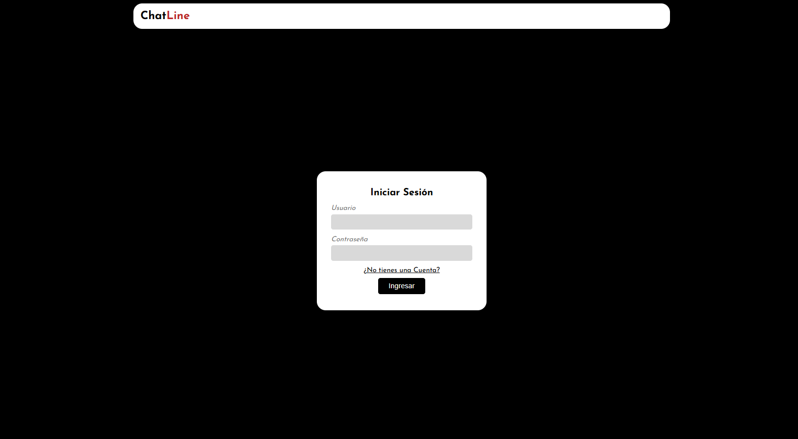
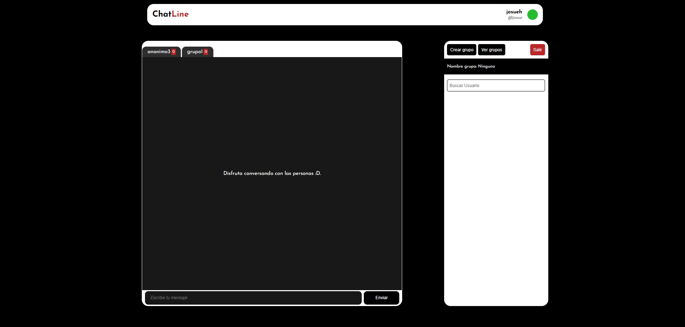

# ChatLine - Chat en tiempo real con Node.js, Socket.IO y JWT
> ⚠️⚠️⚠️⚠️Nota: Esta app está desplegada en un servidor gratuito (Render). Puede tardar unos segundos en cargar si no se ha usado recientemente.

 ChatLine es una aplicación de chat en tiempo real desarrollada con Node.js, Express y WebSockets. Permite la comunicación instantánea entre usuarios, la creación de grupos, y la gestión de mensajes privados y grupales. La autenticación se realiza mediante JWT y cookies seguras, garantizando la protección de las sesiones de usuario.
## Capturas de pantalla

### Pantalla de Login


### Chat General 



## Características principales

- **Chat en tiempo real:** Comunicación instantánea entre usuarios y grupos usando WebSockets.
- **Autenticación segura:** Verificación de usuario con JWT y manejo de cookies seguras.
- **Creación de grupos:** Crea grupos de chat para hablar con muchas personas.
- **Mensajes privados y grupales:** Envía mensajes tanto en grupos como en conversaciones privadas.
- **Notificaciones:** Recibe alertas visuales de nuevos mensajes y eventos importantes.
- **Interfaz moderna:** UI modular y responsiva, fácil de usar y personalizar.
- **Protección contra spam:** Limitador de mensajes y anti-spam básico.

## Tecnologías utilizadas

- **Backend:** Node.js, Express, Socket.io
- **Frontend:** JavaScript, HTML, CSS, EJS
- **Base de datos:** Turso - SQLite
- **Autenticación:** JWT, cookies seguras

## Instalación

1. Clona el repositorio:
   ```bash
   git clone https://github.com/Huayapa/ChatLineProyect.git
   cd chatline
   ```
2. Instala las dependencias:
   ```bash
   npm install
   ```
3. Configura las variables de entorno:
   - Crea un archivo `.env` en la raíz con tus claves y configuración:
     ```env
     DB_TOKEN=tu_token_db
     JWT_SECRET=tu_secreto_jwt
     COOKIE_SECRET=tu_secreto_cookie
     SOCKET_URL=http://localhost:3000
     ```
4. Inicia la aplicación:
   ```bash
   npm run dev
   ```


## Seguridad

- Las sesiones de usuario se verifican con JWT y cookies seguras.
- Los datos sensibles no se exponen en el frontend.
- El sistema incluye protección básica contra spam y abuso.

## Estructura del proyecto

```
server/
├──  config/
├──  controllers/
├──  middleware/
├──  models/
├──  public/
│   ├── app/
│   ├── assets/
│   ├── css/
│   ├── features/
│   │   ├── auth/
│   │   ├── chat/
│   │   └── group/
│   ├── ui/
│   ├── utils/
│   └── main.js
├──  routes/
├──  services/
├──  sockets/
│   ├── handlers/
│   ├── timers/
│   └── chatsocket.js
├──  utils/
├──  views/
package.json
```

## Licencia

Este proyecto está bajo la [Licencia GNU GPL v3](https://www.gnu.org/licenses/gpl-3.0.html).

## Autor

Desarrollado por Josue Huayapa.
📧 contactohuayapa@gmail.com
💼 [LinkedIn](https://www.linkedin.com/in/josue-huayapa-630a19316/) | [Portafolio](https://portafolio-huayapa.vercel.app/)

Copyright (c) 2025 Josue Huayapa

---
Este proyecto es parte de mi portafolio profesional y está destinado a demostrar mis habilidades técnicas.
Queda prohibida la venta, redistribución comercial o cualquier uso con fines de lucro sin autorización expresa del autor.
